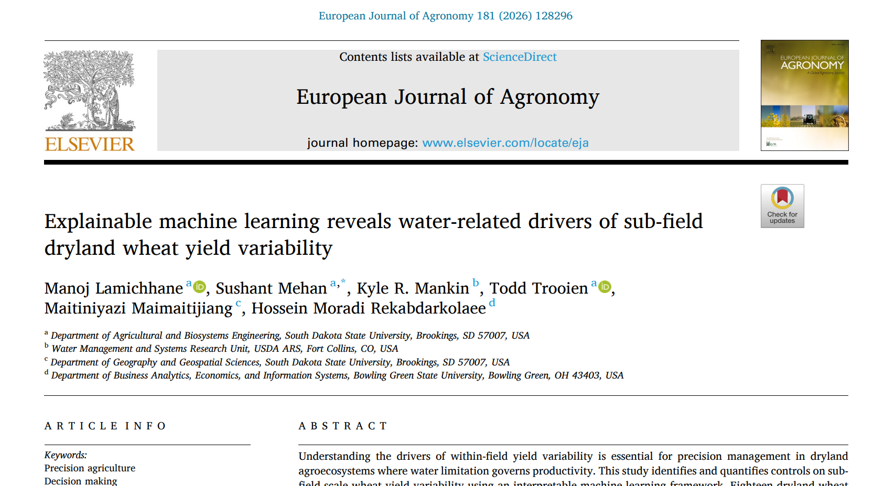
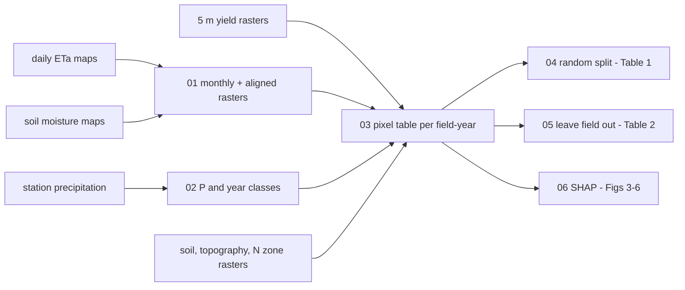

# Explainable ML for sub-field wheat yield: which water signals matter?

Code for the paper:

> Lamichhane, M., Mehan, S., Mankin, K. R., Trooien, T., Maimaitijiang, M., & Moradi Rekabdarkolaee, H. (2026). Explainable machine learning reveals water-related drivers of sub-field dryland wheat yield variability. *European Journal of Agronomy*, 181, 128296. https://doi.org/10.1016/j.eja.2026.128296 (open access)

[](https://doi.org/10.1016/j.eja.2026.128296)
[](LICENSE)


<p align="center">
  <a href="https://doi.org/10.1016/j.eja.2026.128296">
    
  </a><br>
  <sub>Click the image to open the paper (open access, CC BY-NC 4.0).</sub>
</p>

## Overview

This project asks what drives yield differences *within* a field, using 5 m yield maps from 18 dryland winter wheat fields in northeastern Colorado (2019-2024). The fields belong to two management systems, which are modelled separately and together:

- **ASP:** 12 fields, no-till, four-year rotation, nitrogen applied by yield-potential zone.
- **BAU:** 6 fields, reduced tillage, wheat-fallow rotation, one uniform nitrogen rate.

Every 5 m pixel is described by features available **by mid-April**, while management can still change. These include:

- soil texture, organic matter, carbon and pH,
- topography: elevation, slope, aspect, curvature, TPI,
- the nitrogen zone,
- three water signals:
  - accumulated precipitation (P),
  - growing-season soil moisture at 30, 60 and 90 cm (SM, from an ML model),
  - growing-season actual evapotranspiration (ETa, from an ML model).

The ML design:

- **Eight feature cases.** These add or remove P, SM and ETa systematically, to measure what each water signal contributes. Case 8 drops the soil properties, so it uses only remotely available data.
- **XGBoost with two validation strategies:**
  - **Strategy 1:** a random 75/25 split with 5-fold CV, for 3 field groups × 4 climate classes (all, dry, normal, wet years) × 8 cases, i.e. 96 models.
  - **Strategy 2:** leave one field out, so the model must predict fields it has never seen.
- **SHAP.** Global importance, direction of effects, and pixel-level SHAP maps that show *where* in a field each driver raises or lowers yield.

<p align="center">
  <br>
  <sub>Methodological flowchart from Lamichhane et al. (2026), CC BY-NC 4.0.</sub>
</p>

## Key results

**Random 75/25 split (Table 1, all years):** the models explain about 90% of pixel-level yield variance.

| Field group | R² (Cases 1-8) | RMSE (kg/ha) |
|---|---|---|
| ASP + BAU | 0.90-0.92 | 498-541 |
| ASP | 0.92-0.93 | 490-536 |
| BAU | 0.88-0.89 | 495-524 |

**Leave one field out (Table 2):** harder, and the honest test of transfer to new fields.

| Case | ASP + BAU R² | ASP R² | BAU R² |
|---|---|---|---|
| 1: P | 0.53 | 0.76 | 0.53 |
| 3: ETa | **0.62** | 0.77 | **0.60** |
| 6: SM + ETa | **0.62** | 0.79 | 0.56 |
| 7: P + SM + ETa | 0.61 | **0.80** | 0.57 |
| 8: no soil properties | 0.53 | 0.77 | 0.35 |

- **Accuracy drops for unseen fields.** Under the random split all cases are close, because the water signals partly stand in for one another. When whole fields are held out, the cases with ETa (alone or with SM) transfer best.
- **ETa is the most spatially informative water signal** in the SHAP analysis. P mainly separates years, since it is a single station value per year.
- **The nitrogen zone ranks among the top drivers in ASP fields,** most likely because the zones encode historical yield potential. **Elevation** is a secondary but steady control in both systems.
- **Without soil properties (Case 8), ASP accuracy barely changes,** so a model built only from remotely available data is realistic there.

<!-- After running notebooks 04 and 06 with the real data, these images will exist: -->
<p align="center">
  
</p>

## Pipeline



| Notebook | What it does | Paper output |
|---|---|---|
| `01_raster_preprocessing` | Monthly means of ETa and SM rasters, warped to the DEM projection | - |
| `02_precipitation_year_classes` | P from 1 Oct to 15 Apr; dry/normal/wet years from the 1993-2022 record | Table S4 |
| `03_pixel_dataset` | Samples every feature at the 5 m yield pixels, one csv per field-year | Fig. S1 |
| `04_strategy1_random_split` | 96 XGBoost models, 5-fold CV and 25% hold-out | **Table 1**, Tables S2, S5, S6 |
| `05_strategy2_leave_field_out` | Leave-one-field-out for ASP, BAU and ASP+BAU | **Table 2** |
| `06_shap_analysis` | SHAP summaries per case and climate class, SHAP maps within fields | Figs. 3-6, S6-S11 |

`src/yieldml.py` holds the feature cases, field lists, year classes and the data loader shared by notebooks 04-06.

## Getting started

```bash
git clone https://github.com/manojlamichhane-ml/dryland-wheat-yield-xai.git
cd dryland-wheat-yield-xai

conda env create -f environment.yml      # GDAL is easiest to install from conda-forge
conda activate wheat-yield-xai

jupyter lab
```

The data are available from the authors on request. With the field-year tables placed in `data/model_input/ASP` and `data/model_input/BAU`, notebooks 04-06 reproduce the tables and figures. See [`data/README.md`](data/README.md) for the layout and columns.

## Repository structure

```
dryland-wheat-yield-xai/
├── notebooks/        pipeline, run in numeric order
├── src/yieldml.py    feature cases and data loading
├── data/             inputs (see data/README.md, not tracked)
├── results/
│   ├── figures/      figures written by the notebooks
│   └── tables/       Tables 1, 2 and supplementary tables
├── docs/             images used in this README
├── environment.yml
├── requirements.txt
└── CITATION.cff
```

## Notes

- **Every pixel of a field-year gets the same P value.** P therefore explains differences between years, not within a field. SHAP importance for P should be read that way.
- **Strategy 2 adds preprocessing inside each fold.** The year is included as a feature, features are standardised per year using training-field statistics, and hyperparameters are tuned by a randomised search on 80% of the training pixels. The details are in notebook 05.
- **BAU has only 6 fields in alternating years.** Holding one out removes a large share of BAU data, so the BAU field-out scores are more variable.
- **SHAP values describe the models, not causation.** This matters especially for the nitrogen zones, which were drawn from past yields.
- **Runtimes on a laptop:** notebook 04 takes a few minutes, notebook 05 about an hour per field group, and notebook 06 about 10-20 minutes.

## Citation

If you use this code, please cite the paper (see [`CITATION.cff`](CITATION.cff)):

```bibtex
@article{lamichhane2026yield,
  title   = {Explainable machine learning reveals water-related drivers of sub-field dryland wheat yield variability},
  author  = {Lamichhane, Manoj and Mehan, Sushant and Mankin, Kyle R. and Trooien, Todd and Maimaitijiang, Maitiniyazi and Moradi Rekabdarkolaee, Hossein},
  journal = {European Journal of Agronomy},
  volume  = {181},
  pages   = {128296},
  year    = {2026},
  doi     = {10.1016/j.eja.2026.128296}
}
```

## Acknowledgements

Supported in part by USDA NIFA Hatch SD00H817-24/SD00R793-26 and Agreement 58-3012-3-019 with USDA-ARS, Water Management and Systems Research Unit, Fort Collins, CO. Thanks to everyone who contributed to the field operations and data collection.

## Contact

Manoj Lamichhane - [manoj.lamichhane@jacks.sdstate.edu](mailto:manoj.lamichhane@jacks.sdstate.edu) - [LinkedIn](https://www.linkedin.com/in/manoj-lamichhane-ph-d-58455028b/)
